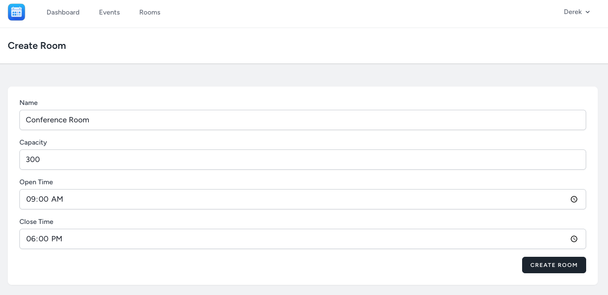
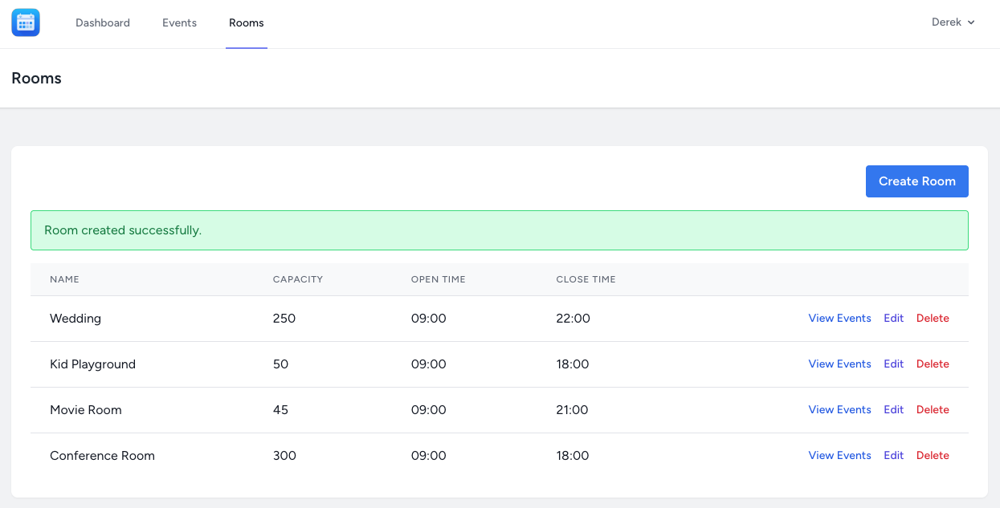
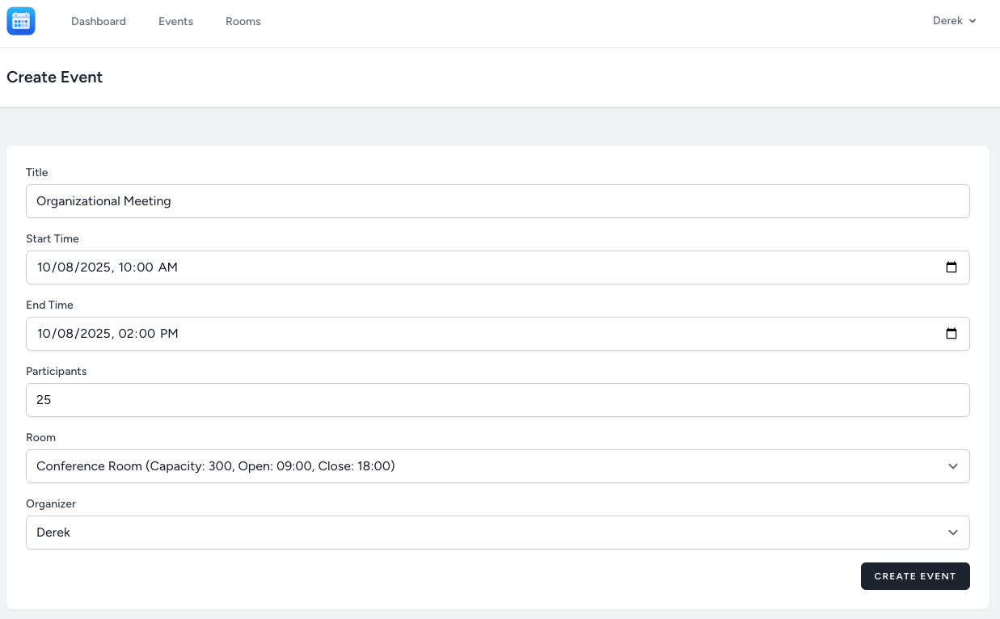
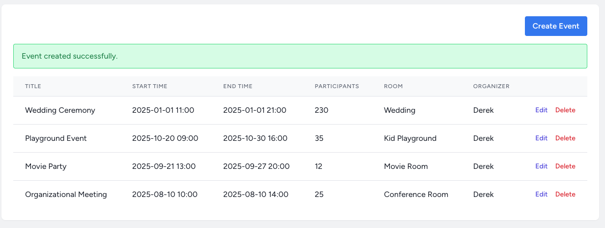
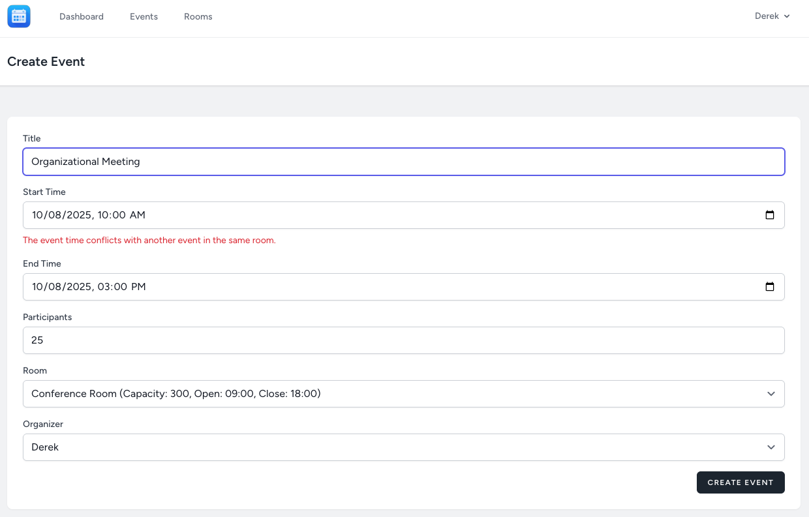

# Event Management System

This project is an **Event Management System** developed as an assignment for a **Web Application Development course** at Asia-Pacific International University.

## Project Overview

The system is designed to allow administrators to schedule events in various rooms, ensuring that several critical constraints are respected:

-   **No overlapping time conflicts:** Events in the same room cannot overlap.
-   **Room capacity limits:** The number of participants for an event must not exceed the room's capacity.
-   **Event time within room operating hours:** Events must fit within the defined open and close times of a room.

The application provides a user-friendly interface for managing events and rooms, along with a dashboard featuring a calendar view of all scheduled events.

## Features

-   **User Authentication:** Secure user registration, login, and profile management powered by Laravel Breeze.
-   **Room Management (CRUD):** Create, View, Edit, and Delete rooms with attributes like name, capacity, open time, and close time.
-   **Event Management (CRUD):** Create, View, Edit, and Delete events with attributes like title, start time, end time, participants, assigned room, and organizer.
-   **Event Scheduling Validation:** Robust validation rules to prevent:
    -   Time conflicts between events in the same room (with a 15-minute buffer).
    -   Events exceeding room capacity.
    -   Events starting before a room's open time or ending after its close time.
    -   Events spanning multiple days if the room has daily operating hours (ensuring start/end times respect daily limits).
-   **Dashboard Calendar:** An interactive calendar view (powered by FullCalendar) on the dashboard displaying all scheduled events.
-   **Events by Room View:** A dedicated page to view all events scheduled for a specific room.

## Technologies Used

-   **PHP 8.2+**
-   **Laravel 10/11** (Framework)
-   **MySQL/SQLite** (Database)
-   **Blade** (Templating Engine)
-   **TailwindCSS** (Styling Framework)
-   **Alpine.js** (JavaScript Framework, via Laravel Breeze)
-   **FullCalendar.io** (JavaScript Calendar Library)
-   **NPM / Vite** (Frontend Asset Bundling)

## Setup Instructions

To get the project up and running on your local machine, follow these steps:

1.  **Clone the repository:**
    ```bash
    git clone https://github.com/Asia-Pacific-International-university/event-scheduler-TainYanTun.git
    cd event-management-system
    ```

2.  **Install PHP Dependencies:**
    ```bash
    composer install
    ```

3.  **Copy Environment File:**
    ```bash
    cp .env.example .env
    ```

4.  **Generate Application Key:**
    ```bash
    php artisan key:generate
    ```

5.  **Configure Database:**
    -   Open `.env` and configure your database connection (e.g., `DB_CONNECTION=sqlite`, `DB_DATABASE=./database/database.sqlite`). If using SQLite, ensure the `database.sqlite` file exists in the `database/` directory (`touch database/database.sqlite`).

6.  **Run Migrations:**
    ```bash
    php artisan migrate
    ```

7.  **Install Node Dependencies & Compile Assets:**
    ```bash
    npm install
    npm run dev
    ```

8.  **Start the Development Server:**
    ```bash
    php artisan serve
    ```

    The application will be accessible at `http://127.0.0.1:8000`.

## Usage

1.  **Access the Application:** Open your browser and go to `http://127.0.0.1:8000`.
2.  **Register/Login:** You will be redirected to the login page. If you don't have an account, click 'Register' to create one.
3.  **Dashboard:** After logging in, you'll be taken to the dashboard, which displays a calendar of all events.
4.  **Manage Rooms:** Use the 'Rooms' link in the navigation bar to create, edit, or delete rooms. You can also view events specific to a room from here.
5.  **Manage Events:** Use the 'Events' link in the navigation bar to create, edit, or delete events.

## Constraint Logic Explanation

All scheduling constraints are enforced through custom validation logic within the `App\Http\Requests\StoreEventRequest` class.

### 1. Time Conflict (Overlapping Events)

-   **Formula:** `new_start < existing_end AND new_end > existing_start`
-   **Implementation:** A database query checks for existing events in the same room that overlap with the proposed new event's time frame. A 15-minute buffer is added to both start and end times to ensure a minimum gap between consecutive events.
-   **Update Handling:** When editing an event, the validation intelligently ignores the event being updated to prevent it from conflicting with its own existing schedule.

### 2. Room Capacity

-   **Rule:** `event_participants <= room_capacity`
-   **Implementation:** The number of participants provided for an event is compared against the `capacity` attribute of the selected room. If the event's participants exceed the room's capacity, a validation error is triggered.

### 3. Room Availability (Operating Hours)

-   **Rule:** Event must be within room `open_time` and `close_time`.
-   **Implementation:** The event's start time (hour and minute) is checked against the room's `open_time`, and the event's end time (hour and minute) is checked against the room's `close_time`. If any part of the event falls outside these daily operating hours, a validation error occurs.
-   **Multi-Day Events:** The current implementation allows multi-day events, but strictly enforces that the event's start time (on its start day) must be after or equal to the room's `open_time`, and the event's end time (on its end day) must be before or equal to the room's `close_time`. This ensures that even multi-day events respect the daily operational window of the room.

## Testing Screenshots and Results

### 1. Create a Room



### 2. Successfully Created a Room



### 3. Create an Event with that Room



### 4. Successfully Created an Event



### 5. Conflict Validation

Creating another event with the exact same room, time, and date results in a validation error, as expected.



## Reflection

This project was a great learning experience, but it definitely came with its share of challenges.

One of the main difficulties I faced was getting the time-based validation just right. At first, I was just checking for simple overlaps, but then I had to account for the 15-minute buffer between events. I spent a lot of time debugging my queries to make sure they correctly handled all the edge cases, like events ending right when another one was supposed to start. I ended up using a combination of `where` clauses in my Laravel validation rule to check for all the possible overlap scenarios. It was a bit of a headache, but it was really satisfying when it finally worked perfectly.

Another challenge was integrating the FullCalendar.io library with my Laravel backend. It took me a while to figure out how to format the event data from my database into the JSON format that FullCalendar expected. I had to create a new controller method to fetch the events and return them as JSON. I also had to write some JavaScript to initialize the calendar and handle the event rendering.

For this project, I used an AI assistant to help me with a few things. I used it to help me brainstorm the initial database schema and to get some ideas for the overall project structure. I also used it to help me debug some of my validation logic. For example, I was having trouble with a specific query, and the AI helped me spot a mistake in my logic. It was like having a pair programmer that I could bounce ideas off of. It didn't write the code for me, but it definitely helped me get unstuck a few times and pointed me in the right direction. It was a really useful tool for learning and for speeding up my development process.

Overall, this is quite rewarding experience and certainly helpful in future upcoming projects